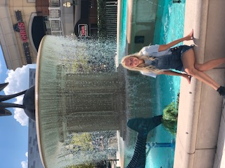

<!DOCTYPE HTML>
<!--
	Prologue by HTML5 UP
	html5up.net | @ajlkn
	Free for personal and commercial use under the CCA 3.0 license (html5up.net/license)
-->
<html>
	<head>
		<title>https://rennynoelle.github.io</title>
		<meta charset="utf-8" />
		<meta name="viewport" content="width=device-width, initial-scale=1, user-scalable=no" />
		<link rel="stylesheet" href="assets/css/main.css" />
	</head>
	<body class="is-preload">

		<!-- Header -->
			

				

					<!-- Logo -->
						

							
							<h1 id="title">Renny Clements</h1>
							
Chemistry Major 
								ACS Concentration

						

					<!-- Nav -->
						<nav id="nav">
							<ul>
								<li><a href="#top" id="top-link">Intro</a></li>
								<li><a href="#portfolio" id="portfolio-link">Portfolio</a></li>
								<li><a href="#about" id="about-link">About Me</a></li>
								<li><a href="#contact" id="contact-link">Contact</a></li>
							</ul>
						</nav>

				

				

					<!-- Social Icons -->
						<ul class="icons">
							<li><a href="#https://github.com/RennyNoelle" class="icon brands fa-github">Github</a></li>
							<li><a href="#www.linkedin.com/in/renny-clements-a606031a0" class="icon brands fa-LinkedIn">LinkedIn</a></li>
							<li><a href="#rennynoelle28@gmail.com" class="icon solid fa-envelope">Email</a></li>
						</ul>

				

			

		<!-- Main -->
			

				<!-- Intro -->
					<section id="top" class="one dark cover">
						

							<header>
								<h2 class="alt">Hi! I'm <strong>Renny Clements</strong>,
								
This is my very first website using code 
								Join me on my journey to develop more programming skills!

							</header>

							<footer>
								<a href="#portfolio" class="button scrolly">About Me</a>
							</footer>

						

					</section>

				<!-- About Me -->
					<section id="portfolio" class="two">
						

							<header>
								<h2>About Me</h2>
							</header>

							
Hello! My name is Renny Clements and I am a Senior Chemistry major at James Madison
							University. I was born in Virginia Beach, VA and have lived there my entire life.
							I am looking to find a job in research in the area in order to stay close to family.
							I would like to work specifically at NASA, Naval Research Lab, and LifeNet.

							

								

									<article class="item">
										
										<header>
											<h3>Town Center Fountain</h3>
										</header>
									</article>
									<article class="item">
										
										<header>
											<h3>My mom, sister, and I</h3>
										</header>
									</article>
								

								

									<article class="item">
										
										<header>
											<h3>Neptune Statue at the Boardwalk</h3>
										</header>
									</article>
									<article class="item">
										
										<header>
											<h3>My dog Bandit</h3>
										</header>
									</article>
								

								

									<article class="item">
										
										<header>
											<h3>My dad and my mom</h3>
										</header>
									</article>
									<article class="item">
										
										<header>
											<h3>My sister and I when we were working together</h3>
										</header>
									</article>
								

							

						

					</section>

				<!-- Resume -->
					<section id="about" class="three">
						

							<header>
								<h2>Resume</h2>
							</header>

							

							
I have included my resume in this website as I am actively searching for a job.

						

					</section>

				<!-- Contact -->
					<section id="contact" class="four">
						

							<header>
								<h2>Contact</h2>
							</header>

							
Please feel free to leave your name and email and I will get back to you in a timely
							manor. If you are a hiring manager, please leave your company and contact information,
							as well as a little bit about your company and what you are looking for.

							<form method="post" action="#">
								

									
<input type="text" name="name" placeholder="Name" />

									
<input type="text" name="email" placeholder="Email" />

									

										<textarea name="message" placeholder="Message"></textarea>
									

									

										<input type="submit" value="Send Message" />
										
Please email me at: Rennynoelle28@gmail.com for all inquiries

									

								

							</form>

						

					</section>

			

		<!-- Footer -->
			

				<!-- Copyright -->
					<ul class="copyright">
						<li>&copy; Untitled. All rights reserved.</li><li>Design: <a href="http://html5up.net">HTML5 UP</a></li>
					</ul>

			

		<!-- Scripts -->
			
			
			
			
			
			
			

	</body>
</html>
